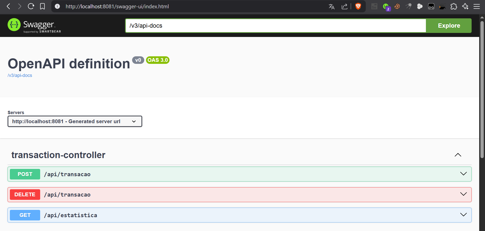
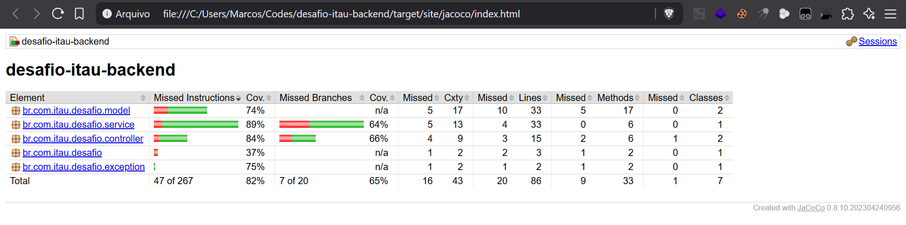

# Desafio Backend - Itaú Unibanco 🚀

[](https://maven.apache.org/)
[](https://adoptium.net/)
[](https://spring.io/projects/spring-boot)
[](target/site/jacoco/index.html)
[](https://www.docker.com/)
[](LICENSE)

---

## 🚀 Tecnologias

- Java 22
- Spring Boot 3.2.4
- Maven 3.9.9
- Spring Validation (Jakarta)
- Testes com JUnit 5
- Swagger OpenAPI 3
- Docker (Containerização)
- JaCoCo (Relatório de Cobertura de Testes)

---

## ⚡ Como Rodar Localmente

```bash
# Clonar o repositório
git clone https://github.com/marcostolosa/desafio-itau-backend.git

# Entrar no diretório
cd desafio-itau-backend

# Buildar o projeto
mvn clean package

# Rodar a aplicação
java -jar target/desafio-itau-backend-1.0-SNAPSHOT.jar --server.port=8080
```

Acesse:
- **API**: [http://localhost:8080](http://localhost:8080)
- **Swagger UI**: [http://localhost:8080/swagger-ui.html](http://localhost:8080/swagger-ui.html)

---

## 🐳 Rodando com Docker

```bash
docker build -t desafio-itau-backend .
docker-compose up 
```

---

## 🧪 Rodando os Testes

```bash
mvn test
```

Relatório de cobertura: [target/site/jacoco/index.html](target/site/jacoco/index.html)


---

## 📁 Endpoints

| Método | Endpoint | Descrição |
|:---|:---|:---|
| `POST` | `/api/transacao` | Registra nova transação |
| `GET` | `/api/estatistica` | Estatísticas últimas 60s |
| `DELETE` | `/api/transacao` | Apaga todas transações |
| `GET` | `/health` | Healthcheck simples |

---

## 📄 Regras de Negócio

- `valor` ≥ 0
- `dataHora` não pode ser futura
- Estatísticas consideram apenas últimos 60 segundos

---

## 💡 Observações

- Caso não haja transações no período de 60s, estatísticas retornam `0`.
- Todas as respostas da API estão no formato JSON.
- Documentação Swagger ativa na raiz do projeto.
